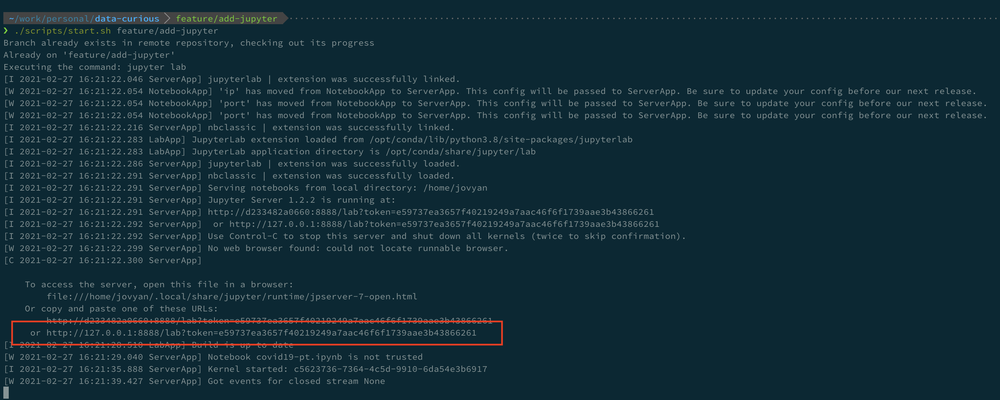

# A data exploration portable environment for the data curious

## Introduction and Problem Statement

The story behind the developments presented here begins with my suspicion over statements regarding `COVID-19` data. Data interpretation presented in the news and social media like `schools don't contribute to virus propagation` really raised my eyebrow and left me wanting to quickly crunch some data and figure out if there was any truth to those kinds of statements. Because I am far from being a data scientist, I just wanted a quick and easy setup and improvised exactly that.

## Proposed solution

In a past project working as a `DevOps` engineer, I had to setup virtual machines (`VMs`) for data scientists to use for what is, for other people, dark magic. They were using `Jupyter` notebooks, which should not come as a surprise to anyone who has even the slightest background in these topics. I am now putting this setup to personal use with some modifications, leveraging two things that a `DevOps` engineer loves: containers and a bit of automation. It allows me to quickly spin up an environment that facilitates crunching some data just with a tiny bit of `Python` knowledge.

### Overview

Additionally to `DevOps` work, I sometimes also write some code - mostly for `PoC`s and that sort of stuff - and I consequently am a groing fan of containerised development environments, so the proposed solution leverages a `Docker` container running `Jupyter Lab`, which is

> a web-based interactive development environment for Jupyter notebooks, code, and data.

There's also some automation in place, using shell scripts, to ease the burden of saving your work using `version control` standards. Despite being really simple commands and operations to someone used to working with `git` or version control systems, it can really facilitate this for those who are not (in the references, you can find a getting started with `git` tutorial).

### Requirements

The setup that I will present has been developed in an `Apple MacBook Pro` running `macOS Big Sur` (Version 11.1), but should be compatible with any `Unix` based operating system.

As for tooling that you require to install on your machine, this setup relies only on:

- `git`
- `Docker`

### Setup and Getting started

The first step is to clone the repository which contains the setup and work for your data exploration environment. In my case, I am cloning my `data-curious` `GitHub` repository (this tutorial is being presented as if I was using it, if you want to replicate this environment you will need to fork my repository or replicate its structure, also copying the automation scripts):

```bash
git clone https://github.com/gnvalente92/data-curious.git
```

That's it, you have everything you need to start crunching some data!

### Usage

#### Start the notebook server

To start the `Jupyter Lab` instance mentioned in the previous sections, it is only necessary that you run the following command (from the root of this repository):

```bash
./scripts/start.sh <[OPTIONAL]BRANCH_NAME>
```
Triggering the script will perform the following actions:
- Depending on if a branch already exists in the remote repository with the selected name, it will either create it or `checkout` it in your current working directory. The branch name is selected in the following way:
    - If you don't pass in the optional argument, the name will be in the form of `feature/work-<CURRENT-DATE>`;
    - If you pass the optional argument, the branch name will be what you provide, assuming it's a valid branch name.
- Spin up a docker container running `Jupyter Lab` and mount this repository's `work/` directory to the working directory of `Jupyter`, which means your notebooks will be shown in the navigation bar and will be saved when you finish your data exploration. 

- After running the script, this will be the console output. Just click the address in red to access the user interface (`UI`).



- Using `Jupyter` notebooks is quite intuitive, I am not going to go into details because I am no expert and you can find everything in other articles and tutorials (see `References` section for the official documentation). Here's a screenshot of a sample notebook I created, it imports and displays a few lines of `COVID` data using `pandas` datasets (this notebook can be found in the `data-curious` repository under `work/covid19-pt.ipynb`):


- The `.gitignore` file in this repository will automatically ignore the internal files generated by the `Jupyter` notebook and only store your actual work.

#### Stop the notebook server

When you are finished with the data exploration and have all your desired notebooks saved, just hit `File/Shut Down` in the `UI` to shut down the notebook server.

Final step, to upload all your work to the `git` repository, is just to run the following script:

```bash
./scripts/save-progress.sh <[OPTIONAL]"COMMIT-MESSAGE">
```

Running this will store your work to yout `git` repository either with a custom commit message, if you provide the optional parameter in the command above or use `Automated commit message`.

## Next steps

If you think there's something fundamentally wrong here or if you have ideas on how to improve this little data exploration environment feel free to contact me, or change it and raise a `PR` in the `data-curious` repository, you'll have my full attention.

Additionally, you can just tweak the behaviour of the shell script on your own, but I'm keen on getting feedback, so get in touch!

## References
- [Getting started with git tutorial](https://product.hubspot.com/blog/git-and-github-tutorial-for-beginners)
- [Jupyter Lab Documentation](https://jupyter.org)
